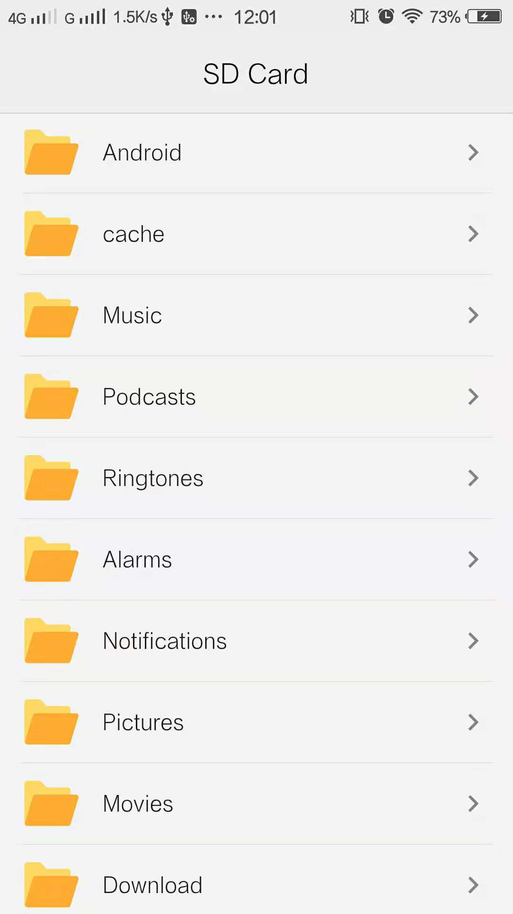

# flutter_file_manager

一个flutter版本的文件管理器，查看SD卡内的文件（android）

### 列出当前文件夹下所有的文件、文件夹
``` dart
void initPathFiles(String path) {
    try {
      setState(() {
        parentDir = Directory(path);
        count = 0;
        files.clear();
        files = parentDir.listSync();
        count = _calculatePointBegin(files);
      });
    } catch (e) {
      print(e);
      print("Directory does not exist！");
    }
  }
```

### 打开文件
打开文件需要用到原生的Intent来实现，在dart中打开一个通道方法，将文件路径传给Java层调用
``` dart
MethodChannel _channel = MethodChannel('openFileChannel');

openFile(String path) {
    final Map<String, dynamic> args = <String, dynamic>{'path': path};
    _channel.invokeMethod('openFile', args);
  }
```
java代码：
``` java
private void openFile(Context context, String path) {
        try {
            if (!path.contains("file://")) {
                path = "file://" + path;
            }
            //获取文件类型
            String[] nameType = path.split("\\.");
            String mimeType = MimeTypeMap.getSingleton().getMimeTypeFromExtension(nameType[1]);

            Intent intent = new Intent();
            intent.addFlags(Intent.FLAG_ACTIVITY_NEW_TASK);
            intent.setAction(Intent.ACTION_VIEW);
            //设置文件的路径和文件类型
            intent.setDataAndType(Uri.parse(path), mimeType);
            //跳转
            context.startActivity(intent);
        } catch (Exception e) {
            System.out.println(e);
        }
    }
```
### 效果图


##### 简书 [flutter版的文件管理器](https://www.jianshu.com/p/a332a20c4ddf)
##### 掘金 [flutter版的文件管理器](https://juejin.im/post/5be3df59e51d4537fc7ad814)